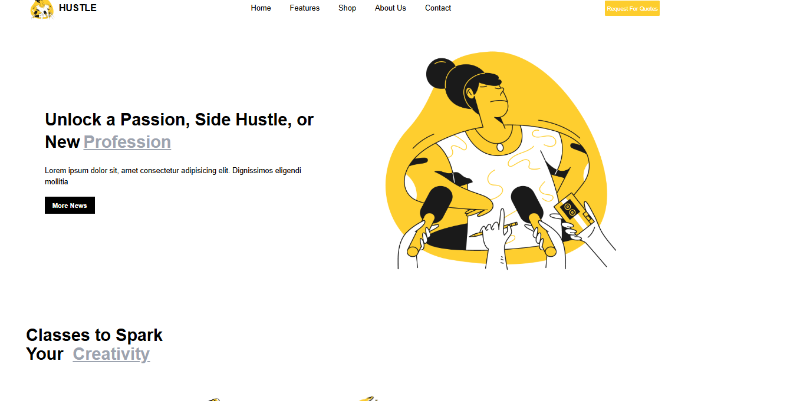

### # Getting Started with Create React App `npm start`

Runs the app in the development mode.\
Open [http://localhost:3000](http://localhost:3000) to view it in your browser.

# Awesome Project

This project does amazing things. Here's a visual of the app:

Demo: https://satria-ws.github.io/marketing-ver1/